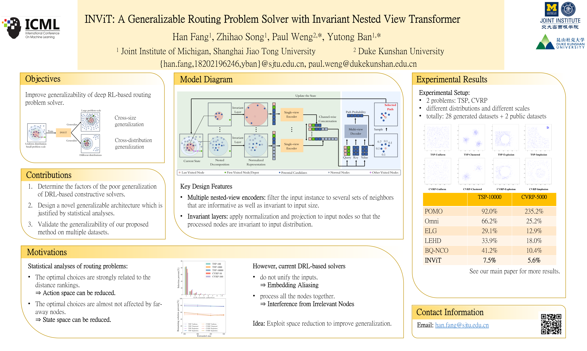

# INViT
Official Implementation of paper: INViT: A Generalizable Routing Problem Solver with Invariant Nested View Transformer.

[Paper link](https://arxiv.org/abs/2402.02317)

## Installations

You are recommended to follow the following installation instructions and use the same version of python modules.

We use anaconda to manage python modules. See [Anaconda 3 official website](https://www.anaconda.com/download/).

**Step 1 — create your own environment**

```
conda create -n [ENV_NAME] python=3.9
conda activate [ENV_NAME]
```

**Step 2 — install pytorch and related modules**

Follow the [Pytorch official webste](https://pytorch.org/get-started/previous-versions/) to install `pytorch==1.12.1`, accompanied with `torchvision==0.13.1` and `torchaudio==0.12.1`

Then install `torch_cluster` with corresponding pytorch version and cuda version

```bash
conda install pytorch==1.12.1 torchvision==0.13.1 torchaudio==0.12.1 cudatoolkit=11.3 -c pytorch
conda install pytorch-cluster -c pyg
```

**Step 3 — install other modules**

```bash
pip install elkai==2.0.1
pip install rich_argparse_plus==0.3.1.4
pip install tqdm==4.66.1
```

**Step 4 - download the dataset**

Dataset is available on [Gdrive address](https://drive.google.com/uc?id=1meYCOULaX_ckosg46Bv1rK8f5sbxMHHV&export=download).


## Execution

### Data Generation

one can also download our generated MSVDRP dataset via (hidden during review)

**Generate Dataset**

```bash
python generator/data_farm.py --problem-type={} --size={} --distribution={} --num={} [--]
```

e.g. to generate 20 TSP-100 instances following clustered distribution (with default parameters), run

```bash
python generator/data_farm.py --problem-type=tsp --size=100 --distribution=clustered --num=20
```

The default output files are stored in `data/data_farm/`

**Solve By Heuristic**

You first need to download dependencies: Gurobi, LKH3 (elkai), PyHyGeSe following their official websites

```bash
python solve_by_Gurobi.py --path={} [--] # Gurobi to solve TSP
python solve_by_lkh.py --path={} [--]    # LKH3 to solve TSP
python solve_by_hgs.py --path={} [--]    # HGS to solve CVRP
```

e.g. to generate the solutions for the above dataset `data/data_farm/tsp/tsp20/tsp20_uniform.txt` using LKH3 with 100 runs, run

```bash
python solve_by_lkh.py --path=data/data_farm/tsp/tsp50/tsp50_uniform.txt --runs=100
```

The default output files are stored in `data/solution_farm/`

**Read Dataset**

We provide API `load_instances_with_baselines()` for reading the MSVDRP datasets in `load_data.py`

- TSP-100: Gurobi
- TSP1000: LKH3-runs10
- TSP-10000: LKH3-runs1
- CVRP: HGS

e.g. load dataset CVRP-50 clustered (group 2), write

```python
from load_data import load_instances_with_baselines
... = load_instances_with_baselines("data/", "cvrp", 50, "clustered2")
```

### Model Training

To train TSP,

```
python train.py --problem TSP --data_path={} [--]
```

To train CVRP,

```
python train.py --problem CVRP --data_path={} [--]
```

### Evaluation

We have provided automatic test after every training. If you want to test the performance independently, for TSP,

```
python train.py --problem TSP --nb_epochs 0 --data_path={} [--] --checkpoint_model={} [--]
# python train.py --problem TSP --nb_epochs 0 --checkpoint_model 24-01-17--09-14-44-n100-gpu0
```

for CVRP,

```
python train.py --problem CVRP --nb_epochs 0 --data_path={} [--] --checkpoint_model={} [--]
# python train.py --problem CVRP --nb_epochs 0 --checkpoint_model 24-01-25--20-50-39-n100-gpu0
```

Note that before testing the model, the parameter should be consistent with the logs of pretrained checkpoint.

